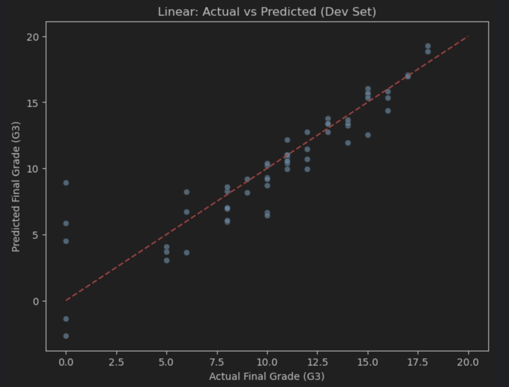
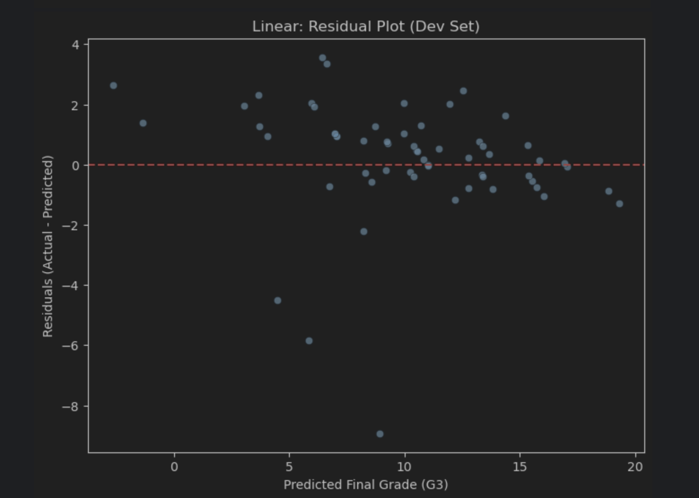
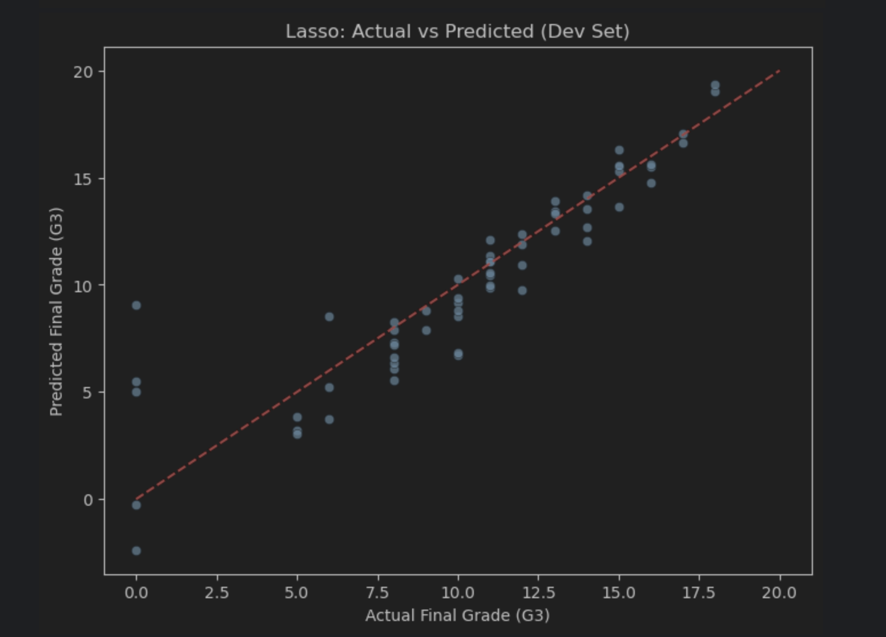
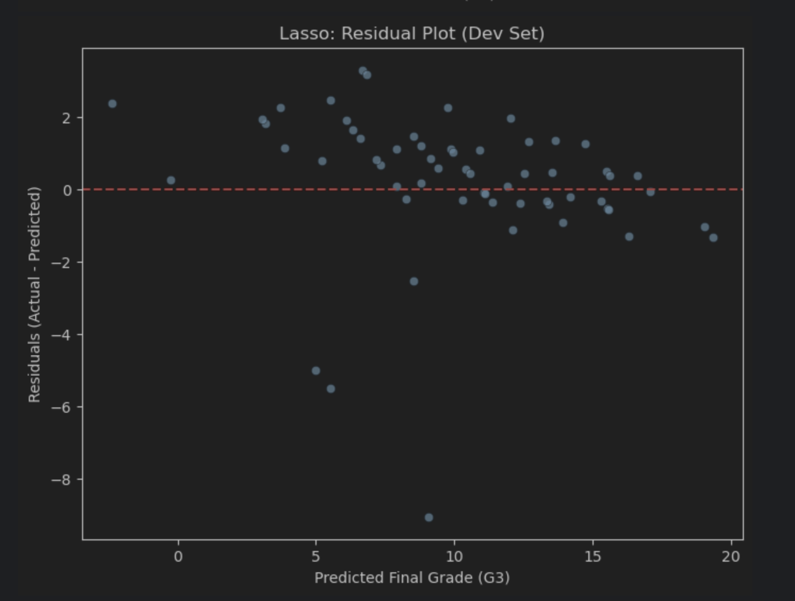
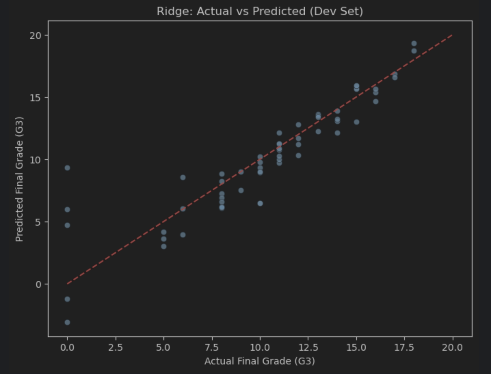
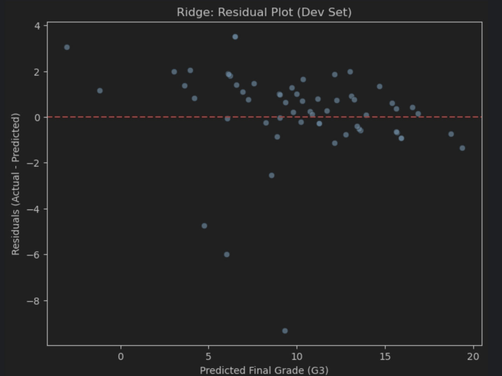
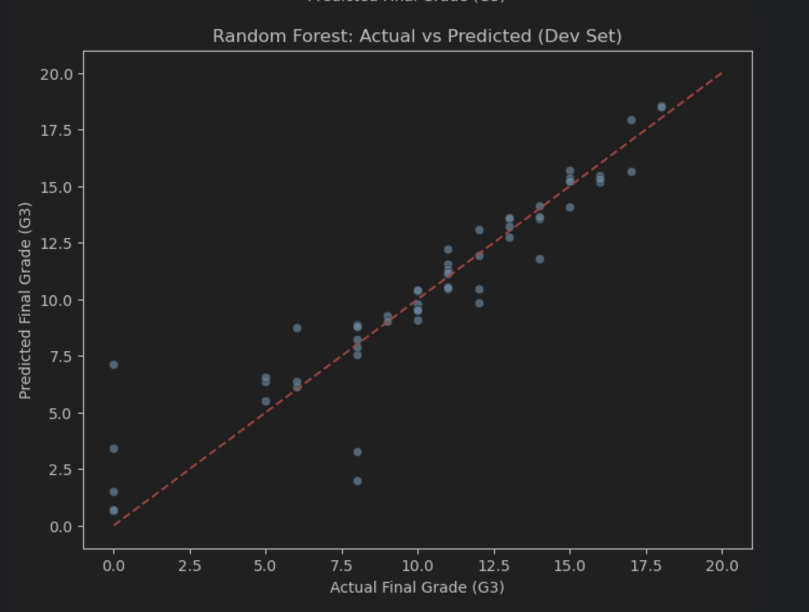
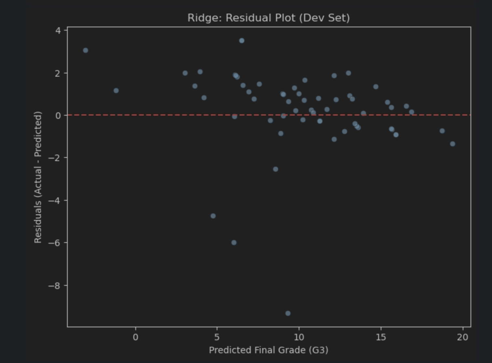

# 🎓 Student Score Prediction

This project predicts student exam scores using **Machine Learning Regression Models**.  
Its a **Multi-Variable Regression** using all available features from the dataset.

---

## 🚀 Project Overview
- **Goal:** Predict students’ final exam scores.  
- **Dataset:** [Student Performance Dataset (Kaggle)](https://www.kaggle.com/datasets/whenamancodes/student-performance)  
- **Models Used:**  
  - Linear Regression  
  - Ridge Regression  
  - Lasso Regression  
  - Random Forest Regressor  
- **Extras:** Feature selection with **Recursive Feature Elimination (RFE)**, residual analysis, and train/dev/test evaluation.  

---

## 📂 Project Structure
```

student-score-prediction/
├── data/              # Dataset
├── notebooks/         # Jupyter notebooks (EDA + models)
├── results/           # Plots & evaluation metrics
└── README.md          # Project documentation

```

---

## 🧠 Linear Regression Intuition
Linear Regression fits a straight line to data:

\[
y = m . x + b
\]

- **x** → Input (multiple features)  
- **y** → Exam score  
- **m** → Coefficients (impact of each feature)  
- **b** → Intercept (baseline score)  

The model minimizes the error between predicted and actual scores.

---

## ⚙️ Model Training
Steps performed:
1. Load dataset (Pandas)  
2. Preprocess features (One-Hot Encoding for categorical vars)  
3. Split into **train/dev/test sets**  
4. Train multiple regression models:  
   - **Linear Regression** (baseline)  
   - **Ridge Regression** (regularization to reduce overfitting)  
   - **Lasso Regression** (feature selection via L1 penalty)  
   - **Random Forest Regressor** (non-linear model for comparison)  
5. Evaluate on Dev & Test sets  
6. Apply **RFE (Recursive Feature Elimination)** to select top features  
7. Retrain best model on Train+Dev and test final performance  

---

## 📈 Evaluation Metrics
We used:  
- **MAE** (Mean Absolute Error) → Avg. error size  
- **RMSE** (Root Mean Squared Error) → Penalizes large errors more  
- **R² Score** → Variance explained by the model  

### Dev Set Results
| Model         | MAE      | RMSE     | R²       |
|---------------|----------|----------|----------|
| Linear        | 1.281224 | 1.956986 | 0.813474 |
| Ridge         | 1.321125 | 2.016186 | 0.802018 |
| Lasso         | 1.297025 | 1.972581 | 0.810489 |
| Random Forest | 0.982000 | 1.651189 | 0.867212 |

---

## 📌Linear Predictions vs Actual
Predicted vs actual scores (Dev set):



Residual analysis (errors):



---

## 📌Lasso Predictions vs Actual
Predicted vs actual scores (Dev set):



Residual analysis (errors):



---

## 📌Ridge Predictions vs Actual
Predicted vs actual scores (Dev set):



Residual analysis (errors):



---

## 📌Random Forest Predictions vs Actual
Predicted vs actual scores (Dev set):



Residual analysis (errors):



---

Perfect 🚀 — let’s rebuild that section with your actual **best model** and **selected features** from RFE:

## 🔍 Feature Selection (RFE)
We applied **Recursive Feature Elimination (RFE)** to identify the most important features for predicting the final exam score.  

The best performing model was **Random Forest**, which achieved the highest accuracy after feature selection.  
It was retrained using only the top features, leading to improved performance and better generalization.  

### Selected Features
```

['age', 'Medu', 'Fedu', 'studytime', 'famrel', 'freetime',
'goout', 'Walc', 'health', 'absences', 'G1', 'G2',
'reason_home', 'schoolsup_yes', 'activities_yes']

```
---

## 📦 Installation & Usage
Clone the repository and install dependencies:

```bash
git clone git@github.com:immuhammad/student-score-prediction.git
cd student-score-prediction
pip install -r requirements.txt
jupyter notebook
````

Run the notebooks in `notebooks/`.

---

## ✅ Requirements

* Python 3.x
* pandas
* scikit-learn
* matplotlib
* seaborn
* jupyter
* openpyxl

---

## 📜 License

MIT License © 2025 Muhammad Ahmad Anwar
